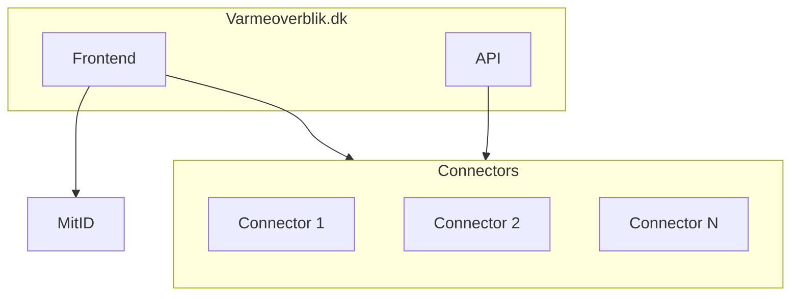

# Varmeoverblik
This repository contains documentation about the setup and use of varmeoverblik. It is primarily targeted towards utility companies which wish to have their customers' data be available through varmeoverblik.dk. It also includes reference implementations for a connector.

## High level architecture

Varmeoverblik.dk has two entry points for users. They can use the web page (frontend) or the API. The frontend communicates with its backend seperately from the API. The backend and the API is split for two reasons; it allows for different swagger documentations, and it simplifies token authentication, as the frontend uses mitId tokens and the API uses custom tokens. Both of these will fetch data from the utility companies' connectors. 

