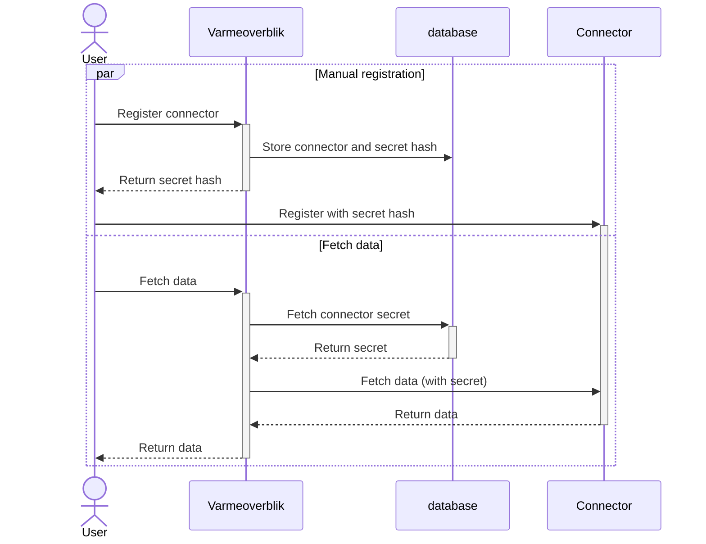

# Register a connector

It needs to be possible to register connectors such that heating providers can share data with Varmeoverblik. The registration process is manual and requires the heating provider to register the connector with Varmeoverblik. The heating provider needs to be logged in with mitID erhverv to be allowed to register a connector. The registration will return a secret which varmeoverblik will use to send to the connector such that the connector knows that requests are coming from varmeoverblik.

