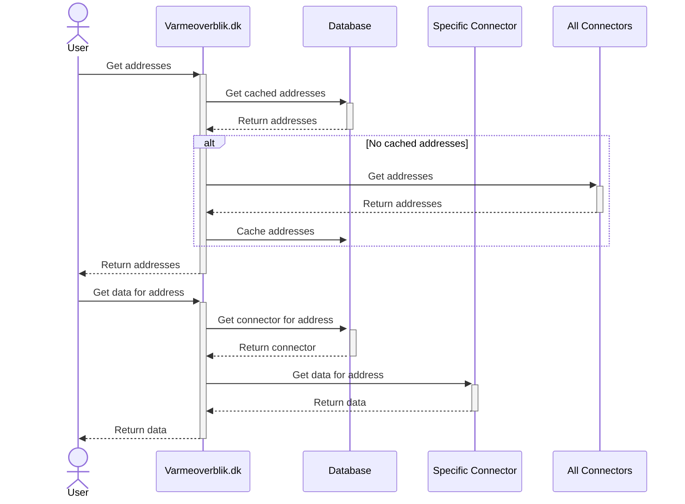

# Fetch data

Data is fetched based on addresses and meters. These a cached in the database to avoid fetching the same data multiple times. If the data is not cached, the data is fetched from the connectors and cached in the database.
It should be possible for the user to force a refresh of cached data.

The user can then fetch data from an address/meter. The system will then fetch the connector for the address/meter and then fetch the data from the connector. This avoids varmeoverblik having to ask all connectors for data.

