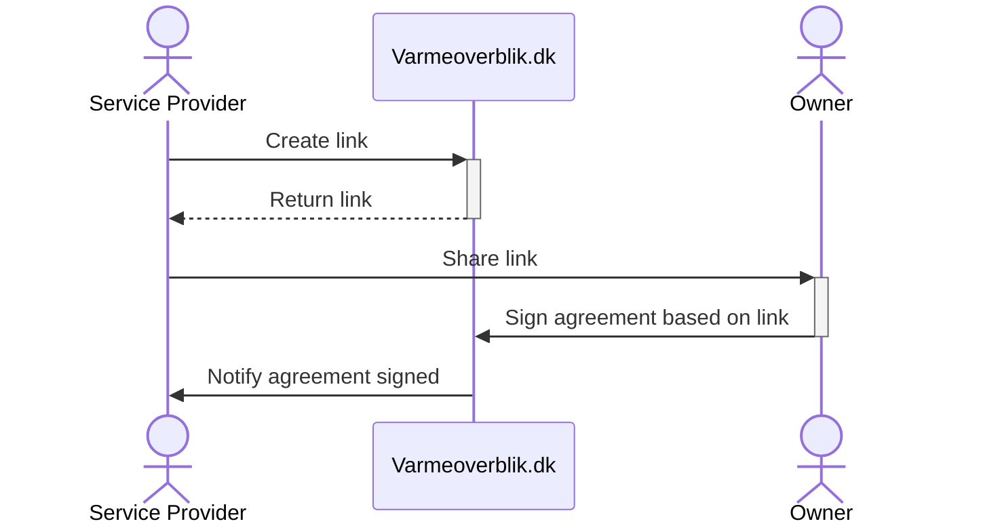

# Create sharing agreement

The service provider creates a link which data owners can use to create a sharing agreement with the service provider. When using the link, the owner will be present with the terms and conditions of the sharing agreement. The owner can then sign the agreement, and the service provider will be notified.

