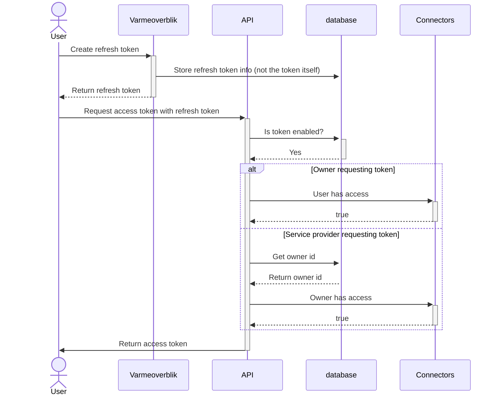

# Token usage

The following sequence diagram shows how the refresh token is used to get an access token. The refresh token is created by the user and stored in the database. The user then requests an access token with the refresh token. The API checks if the token is enabled and if the user has access. If the user has access or sharing agreements grant access, the API returns an access token.

